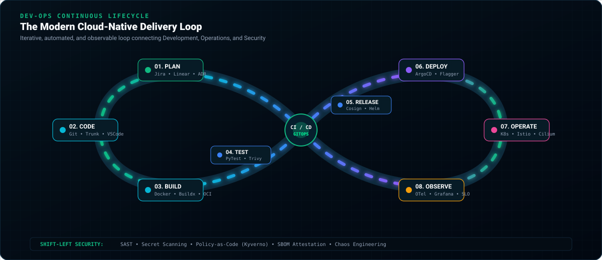
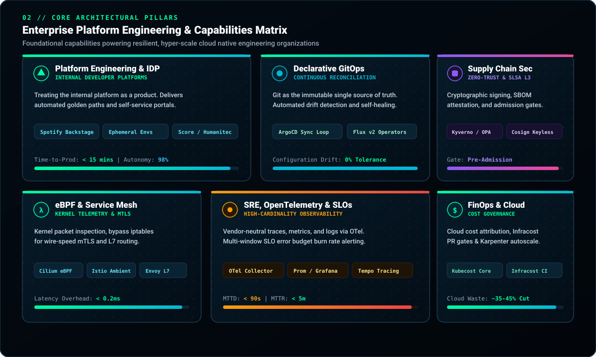
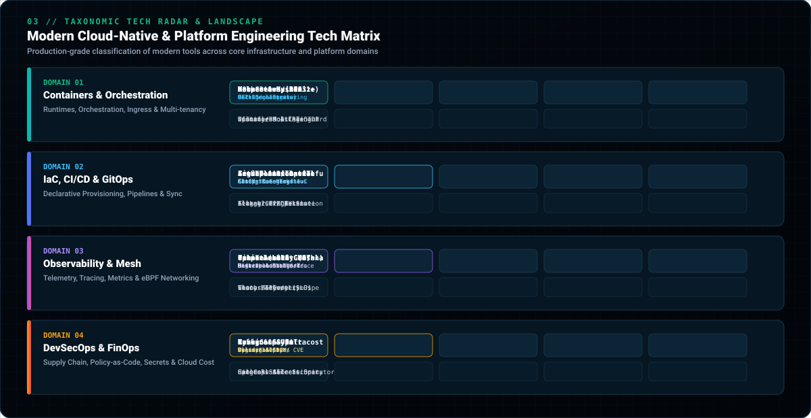
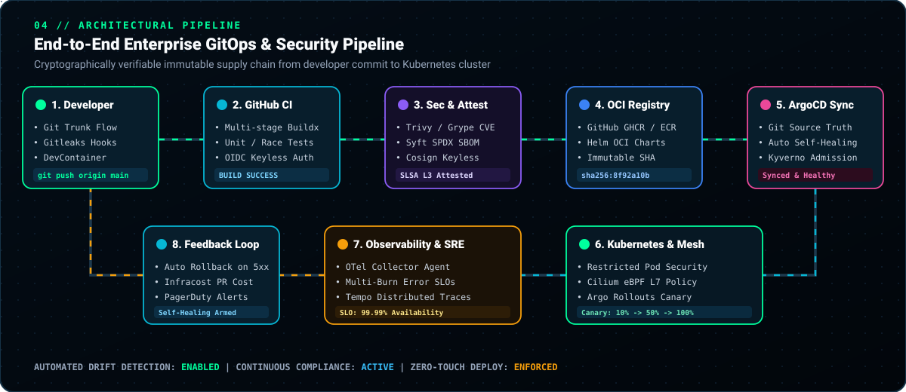
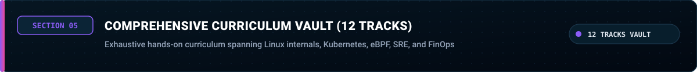
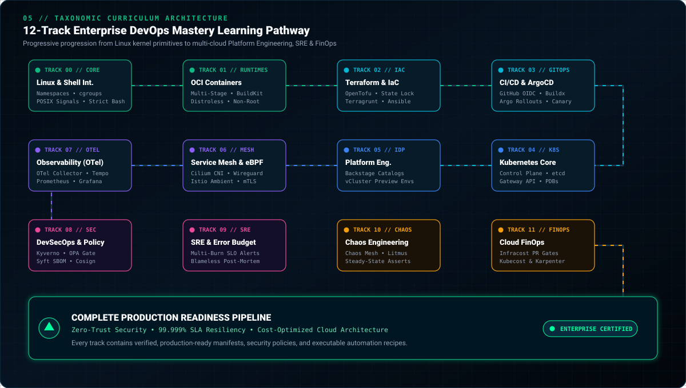

<!-- ========================================================================================= -->
<!--                           ENTERPRISE DEVOPS COMPENDIUM // HERO                            -->
<!-- ========================================================================================= -->

<div align="center">

  <!-- High-Resolution Cyber-Titanium Animated SVG Banner -->
  <a href="https://github.com/Cell1991/Dev-Ops-book">
    
  </a>

  <br/><br/>

  <!-- Responsive Terminal Typing Stream -->
  <a href="https://github.com/Cell1991/Dev-Ops-book">
    
  </a>

  <br/>

  <!-- SYSTEM STATUS BADGES -->
  <p align="center">
    
    
    
    
    
    
    
  </p>

  <br/>

  <strong>The Definitive Enterprise DevOps &amp; Platform Engineering Compendium: A battle-tested, production-grade knowledge vault spanning Linux kernel primitives, rootless OCI containers, Infrastructure as Code, declarative GitOps, Kubernetes internals, eBPF networking, distributed OpenTelemetry, zero-trust DevSecOps, SRE error budgets, chaos engineering, and cloud FinOps governance.</strong>

  <br/><br/>

  <!-- TACTICAL NAVIGATION RADAR & SITEMAP MATRIX -->
  <p align="center">
    <a href="#01-continuous-lifecycle--delivery-loop">
      
    </a>
    <a href="#02-core-architectural-pillars--capabilities">
      
    </a>
    <a href="#03-taxonomic-technology-radar--stack">
      
    </a>
    <a href="#04-enterprise-gitops--supply-chain-pipeline">
      
    </a>
  </p>

  <p align="center">
    <a href="#05-comprehensive-curriculum-vault-12-tracks">
      
    </a>
    <a href="#06-monorepo-architecture--code-tree">
      
    </a>
    <a href="#07-production-quick-start--cli-workflows">
      
    </a>
  </p>

</div>

---

<!-- ========================================================================================= -->
<!--                    01. CONTINUOUS LIFECYCLE & DELIVERY LOOP                               -->
<!-- ========================================================================================= -->

<div align="center">
  
  <br/><br/>
  
</div>

<br/>

| Stage &amp; Focus | Ecosystem &amp; Key Deliverables |
| :--- | :--- |
| **01. Plan**<br/><sub>Product Requirements &amp; ADRs</sub> | `Jira` • `Linear` • `GitHub Projects`<br/> Architectural Decision Records (ADR) &amp; sprint estimation |
| **02. Code**<br/><sub>Trunk-Based Development</sub> | `Git` • `VS Code` • `DevContainers`<br/> Branch protection rules &amp; Gitleaks pre-commit hooks |
| **03. Build**<br/><sub>Deterministic Compilation</sub> | `Docker Buildx` • `BuildKit` • `Kaniko`<br/> Non-root distroless images &amp; layer cache mounts |
| **04. Test**<br/><sub>Continuous Verification</sub> | `PyTest` • `Go Test` • `Trivy` • `Semgrep`<br/> SARIF security scan reports &amp; race condition tests |
| **05. Release**<br/><sub>Supply Chain Attestation</sub> | `Cosign` • `Syft` • `Helm OCI`<br/> SPDX SBOMs &amp; cryptographic provenance signatures |
| **06. Deploy**<br/><sub>Progressive Delivery</sub> | `ArgoCD` • `Argo Rollouts` • `Flagger`<br/> Automated canary analysis &amp; instant rollback on 5xx |
| **07. Operate**<br/><sub>Kernel Mesh &amp; Routing</sub> | `Kubernetes` • `Cilium eBPF` • `Istio`<br/> Gateway API routing &amp; zero-trust wire-speed mTLS |
| **08. Observe**<br/><sub>High-Cardinality Telemetry</sub> | `OpenTelemetry` • `Prometheus` • `Tempo`<br/> Multi-window SLO burn alerts &amp; trace dashboards |

<br/>

---

<!-- ========================================================================================= -->
<!--                    02. CORE ARCHITECTURAL PILLARS & CAPABILITIES                          -->
<!-- ========================================================================================= -->

<div align="center">
  
  <br/><br/>
  
</div>

<br/>

| Core Architectural Pillar | Operational Impact &amp; Production Guarantees |
| :--- | :--- |
| **Platform Engineering &amp; IDP**<br/><sub>Spotify Backstage • Score.dev</sub> | **&lt; 15 min Time-to-Production**<br/>Self-service developer portals &amp; standardized Golden Paths. |
| **Declarative GitOps Engine**<br/><sub>ArgoCD • Flux v2</sub> | **0% Configuration Drift**<br/>Git single source of truth with automated continuous self-healing. |
| **eBPF-Powered Networking**<br/><sub>Cilium CNI • Istio Ambient</sub> | **&lt; 0.2ms Network Latency**<br/>Bypasses iptables with kernel-level JIT packet evaluation. |
| **Zero-Trust DevSecOps**<br/><sub>Kyverno • Cosign • SLSA L3</sub> | **Pre-Admission Security Gate**<br/>Cryptographic signing, SBOM attestation &amp; CVE scan blocks. |
| **SRE &amp; OpenTelemetry**<br/><sub>OTel Collector • Prometheus</sub> | **&lt; 90s MTTD / &lt; 5m MTTR**<br/>Universal telemetry and multi-window SLO error budget burn alerts. |
| **Cloud FinOps &amp; Governance**<br/><sub>Infracost • Kubecost • Karpenter</sub> | **~35-45% Cloud Waste Reduction**<br/>Shift-left PR cost estimates &amp; just-in-time intelligent node scaling. |

<br/>

---

<!-- ========================================================================================= -->
<!--                    03. TAXONOMIC TECHNOLOGY RADAR & STACK                                 -->
<!-- ========================================================================================= -->

<div align="center">
  
  <br/><br/>
  
</div>

<br/>

### Industry Adoption Radar Classification:

* **Adopt (Proven Standards)**: `Kubernetes`, `Docker Buildx`, `Terraform / OpenTofu`, `GitHub Actions`, `ArgoCD`, `Prometheus / Grafana`, `Cilium eBPF`, `Cosign`, `Trivy`, `Helm 3`.
* **Trial (High Velocity & Modern Growth)**: `OpenTelemetry Collector`, `Kubernetes Gateway API`, `Karpenter Node Autoscaler`, `Spotify Backstage`, `Istio Ambient Mesh`, `Kyverno Policy Engine`, `vCluster`.
* **Assess (Emerging Innovations)**: `Crossplane`, `Score.dev`, `eBPF Falco Modern Runtime`, `Infracost PR Gates`, `Chaos Mesh`.
* **Hold (Legacy / Deprecated)**: `Bare Docker Swarm`, `Legacy Kubernetes Ingress (v1beta1)`, `Long-lived GitFlow feature branches`, `Manual SSH configuration drift`, `Hardcoded static cloud API tokens`.

<br/>

---

<!-- ========================================================================================= -->
<!--                    04. ENTERPRISE GITOPS & SUPPLY CHAIN PIPELINE                          -->
<!-- ========================================================================================= -->

<div align="center">
  
  <br/><br/>
  
</div>

<br/>

---

<!-- ========================================================================================= -->
<!--                    05. COMPREHENSIVE CURRICULUM VAULT (12 TRACKS)                         -->
<!-- ========================================================================================= -->

<div align="center">
  
  <br/><br/>
  
</div>

<br/>

### Track 00 // Foundations, Linux Internals &amp; Git
> Kernel isolation primitives, system calls, cgroups, process signals, defensive shell scripting, and Trunk-Based Development.

| Curriculum Module | Architecture &amp; Verified Manifests |
| :--- | :--- |
| [`00. Linux Internals & Shell`](docs/00-foundations/linux-internals-and-shell.md)<br/><sub>Kernel namespaces, cgroups v2, POSIX signals, strict bash</sub> | [Production Entrypoint Script](docs/00-foundations/linux-internals-and-shell.md#3-high-performance-shell-scripting-standard) |
| [`00. Git & Trunk-Based Dev`](docs/00-foundations/git-trunk-based-development.md)<br/><sub>Trunk-Based Development, Conventional Commits, Git bisect</sub> | [Pre-Commit Security YAML](docs/00-foundations/git-trunk-based-development.md#3-pre-commit-hook-security-configuration) |

<br/>

### Track 01 // Containerization &amp; Modern Runtimes
> OCI image architecture, BuildKit caching, non-root execution, distroless runtimes, and Linux capability stripping.

| Curriculum Module | Architecture &amp; Verified Manifests |
| :--- | :--- |
| [`01. Modern Docker & OCI`](docs/01-containerization/modern-docker-and-oci.md)<br/><sub>Multi-stage builds, BuildKit cache mounts, static binaries</sub> | [`Dockerfile.multistage`](examples/docker/Dockerfile.multistage) |
| [`01. Container Security & Distroless`](docs/01-containerization/container-security-and-distroless.md)<br/><sub>Distroless base, dropping CAP_ALL, readOnlyRootFilesystem</sub> | [`compose.production.yml`](examples/docker/compose.production.yml) |

<br/>

### Track 02 // Infrastructure as Code (IaC) &amp; Config Management
> Declarative cloud provisioning with Terraform / OpenTofu, remote S3 backends with DynamoDB locking, and Ansible automation.

| Curriculum Module | Architecture &amp; Verified Manifests |
| :--- | :--- |
| [`02. Terraform & OpenTofu`](docs/02-infrastructure-as-code/terraform-and-opentofu.md)<br/><sub>State locking, module design, Terragrunt DRY architecture</sub> | [`main.tf`](examples/terraform/main.tf) • [`variables.tf`](examples/terraform/variables.tf) |
| [`02. Ansible Configuration`](docs/02-infrastructure-as-code/ansible-and-configuration-management.md)<br/><sub>Idempotent node hardening, kernel sysctl tuning, Ansible Vault</sub> | [Node Hardening Playbook](docs/02-infrastructure-as-code/ansible-and-configuration-management.md#1-idempotency--role-based-architecture) |

<br/>

### Track 03 // Enterprise CI/CD &amp; Progressive Delivery
> Keyless OIDC cloud authentication, Docker Buildx caching, ArgoCD GitOps reconciliation, and automated canary analysis.

| Curriculum Module | Architecture &amp; Verified Manifests |
| :--- | :--- |
| [`03. GitHub Actions CI`](docs/03-cicd-and-gitops/github-actions-enterprise-pipelines.md)<br/><sub>OIDC Workload Identity, GHA cache, Trivy SARIF reporting</sub> | [`production-pipeline.yml`](examples/cicd/.github/workflows/production-pipeline.yml) |
| [`03. ArgoCD & Canary`](docs/03-cicd-and-gitops/argocd-and-progressive-delivery.md)<br/><sub>Continuous reconciliation loop, self-healing, Argo Rollouts</sub> | [`application.yaml`](examples/cicd/argocd/application.yaml) |

<br/>

### Track 04 // Kubernetes Orchestration &amp; Cloud Native Ecosystem
> Control plane architecture (etcd Raft, API Server, Scheduler), Pod lifecycle probes, PDBs, Helm, and K8s Gateway API.

| Curriculum Module | Architecture &amp; Verified Manifests |
| :--- | :--- |
| [`04. K8s Architecture & Pods`](docs/04-kubernetes-ecosystem/k8s-architecture-and-pod-lifecycle.md)<br/><sub>etcd consensus, Kubelet CRI/CNI, startup/liveness probes, PDB</sub> | [`base-deployment.yaml`](examples/kubernetes/base-deployment.yaml) |
| [`04. Helm & Gateway API`](docs/04-kubernetes-ecosystem/helm-kustomize-gateway-api.md)<br/><sub>Helm 3 OCI packaging, Kustomize overlays, HTTPRoute gateway</sub> | [`gateway-api-route.yaml`](examples/kubernetes/gateway-api-route.yaml) |

<br/>

### Track 05 // Platform Engineering &amp; Internal Developer Platforms (IDP)
> Golden paths, Spotify Backstage software catalog, Score specification, and ephemeral PR preview environments with vCluster.

| Curriculum Module | Architecture &amp; Verified Manifests |
| :--- | :--- |
| [`05. Platform Engineering & IDP`](docs/05-platform-engineering/internal-developer-platforms-idp.md)<br/><sub>Platform as a product, Backstage catalog, developer self-service</sub> | [Backstage Catalog Entity](docs/05-platform-engineering/internal-developer-platforms-idp.md#2-spotify-backstage-catalog-entity-catalog-infoyaml) |
| [`05. Ephemeral Envs & vCluster`](docs/05-platform-engineering/multi-tenancy-and-ephemeral-environments.md)<br/><sub>Virtual clusters (vCluster), PR environment lifecycle, ResourceQuotas</sub> | [vCluster Architecture Guide](docs/05-platform-engineering/multi-tenancy-and-ephemeral-environments.md#1-virtual-clusters-vcluster-architecture) |

<br/>

### Track 06 // Service Mesh, eBPF &amp; Cloud Networking
> High-performance eBPF data planes, Cilium CNI, Istio Ambient mesh (ztunnel &amp; waypoint), and zero-trust L7 network policies.

| Curriculum Module | Architecture &amp; Verified Manifests |
| :--- | :--- |
| [`06. Istio & Zero-Trust Mesh`](docs/06-networking-and-service-mesh/istio-envoy-and-zero-trust.md)<br/><sub>Ambient sidecarless mesh, HBONE protocol, mutual TLS, AuthPolicy</sub> | [Istio AuthPolicy YAML](docs/06-networking-and-service-mesh/istio-envoy-and-zero-trust.md#2-zero-trust-authorizationpolicy-example) |
| [`06. Cilium eBPF Networking`](docs/06-networking-and-service-mesh/cilium-and-ebpf-networking.md)<br/><sub>eBPF kernel hooks, bypass iptables, CiliumNetworkPolicy L7</sub> | [`network-policy.yaml`](examples/kubernetes/network-policy.yaml) |

<br/>

### Track 07 // Observability, OpenTelemetry &amp; SRE Metrics
> OpenTelemetry Collector architecture, W3C tracecontext, Prometheus TSDB, Grafana dashboards, and multi-burn-rate SLO alerts.

| Curriculum Module | Architecture &amp; Verified Manifests |
| :--- | :--- |
| [`07. OpenTelemetry & Tracing`](docs/07-observability-and-telemetry/opentelemetry-collector-and-tracing.md)<br/><sub>OTel Collector pipeline (Receivers, Processors, Exporters), Tempo</sub> | [`otel-collector-config.yaml`](examples/observability/otel-collector-config.yaml) |
| [`07. Prometheus & SLO/SLI`](docs/07-observability-and-telemetry/prometheus-grafana-and-slo-sli.md)<br/><sub>4 Golden Signals, mathematical SLI/SLO modeling, multi-burn alerts</sub> | [`prometheus-rules.yaml`](examples/observability/prometheus-rules.yaml) |

<br/>

### Track 08 // DevSecOps, Policy as Code &amp; Supply Chain
> Kubernetes admission control, Kyverno validation, Syft SBOM generation, and Cosign keyless container signing via Sigstore.

| Curriculum Module | Architecture &amp; Verified Manifests |
| :--- | :--- |
| [`08. Policy as Code: Kyverno`](docs/08-devsecops-and-supply-chain/policy-as-code-kyverno-opa.md)<br/><sub>Validating/Mutating Webhooks, Kyverno ClusterPolicy, block root</sub> | [`kyverno-clusterpolicy.yaml`](examples/security/kyverno-clusterpolicy.yaml) |
| [`08. Supply Chain & Cosign`](docs/08-devsecops-and-supply-chain/sbom-cosign-and-secret-management.md)<br/><sub>SLSA L3 standard, Syft SPDX generation, Cosign keyless signatures</sub> | [`trivy-config.yaml`](examples/security/trivy-config.yaml) |

<br/>

### Track 09 // SRE Principles, Error Budgets &amp; Post-Mortems
> Mathematical error budgets ($1 - \text{SLO}$), deployment freeze gates, blameless post-mortem RCA, and interactive runbooks.

| Curriculum Module | Architecture &amp; Verified Manifests |
| :--- | :--- |
| [`09. Error Budgets & Metrics`](docs/09-sre-and-incident-management/error-budgets-and-reliability-metrics.md)<br/><sub>MTBF, MTTD, MTTR calculations, rolling 30-day budget burn tracking</sub> | [Error Budget Math](docs/09-sre-and-incident-management/error-budgets-and-reliability-metrics.md#1-the-error-budget-calculation-formula) |
| [`09. Blameless Post-Mortems`](docs/09-sre-and-incident-management/postmortem-and-runbook-engineering.md)<br/><sub>5 Whys root cause analysis, incident timeline, actionable P0/P1 tasks</sub> | [SEV-1 Postmortem Template](docs/09-sre-and-incident-management/postmortem-and-runbook-engineering.md#1-blameless-incident-post-mortem-template) |

<br/>

### Track 10 // Chaos Engineering &amp; Resiliency
> Principles of chaos experimentation, steady-state hypothesis formulation, Chaos Mesh CRDs, and network partition simulations.

| Curriculum Module | Architecture &amp; Verified Manifests |
| :--- | :--- |
| [`10. Chaos Mesh Testing`](docs/10-chaos-engineering/chaos-mesh-and-resilience-testing.md)<br/><sub>Steady-state verification, Pod failure injection, cross-AZ latency</sub> | [NetworkChaos Manifest](docs/10-chaos-engineering/chaos-mesh-and-resilience-testing.md#2-chaos-mesh-experiment-network-latency--packet-loss) |

<br/>

### Track 11 // Cloud FinOps &amp; Cost Governance
> FinOps Framework (Inform, Optimize, Operate), Infracost PR cost estimations, Kubecost allocation, and Karpenter JIT scaling.

| Curriculum Module | Architecture &amp; Verified Manifests |
| :--- | :--- |
| [`11. FinOps & Cost Governance`](docs/11-finops-and-cost-optimization/cloud-cost-governance-and-kubecost.md)<br/><sub>Shift-left cost gates, container rightsizing, Graviton spot instances</sub> | [Infracost PR Workflow](docs/11-finops-and-cost-optimization/cloud-cost-governance-and-kubecost.md#2-shift-left-cost-estimation-with-infracost-in-github-actions) |

<br/>

---

<!-- ========================================================================================= -->
<!--                    06. MONOREPO ARCHITECTURE & CODE TREE                                  -->
<!-- ========================================================================================= -->

<div align="center">
  
</div>

<br/>

```text
Dev-Ops/
 assets/                                     # High-Resolution Animated SVG Visuals
    hero-banner.svg                         # Cyber-Titanium Animated Hero Banner
    devops-lifecycle.svg                    # Interactive Continuous Delivery Infinity Loop
    bento-matrix.svg                        # 6-Pillar Core Architectural Matrix
    tech-stack-matrix.svg                   # Categorized Technology Radar Landscape
    gitops-pipeline.svg                     # End-to-End Cryptographic Delivery Flow
    devops-curriculum-map.svg               # 12-Track Comprehensive Curriculum Map
    banner_01.svg ... banner_07.svg         # Clean Master Section Header Dividers
    sec_00.svg ... sec_11.svg               # Individual Track Badges
    footer.svg                              # Monorepo Footer Banner
 docs/                                       # In-Depth Theoretical & Architectural Guides
    00-foundations/                         # Linux Internals, Syscalls, cgroups & Git TBD
    01-containerization/                    # Multi-stage Docker, Distroless & Capabilities
    02-infrastructure-as-code/              # Terraform, OpenTofu State & Ansible Playbooks
    03-cicd-and-gitops/                     # OIDC GitHub Actions & ArgoCD Reconcilers
    04-kubernetes-ecosystem/                # K8s Internals, Probes & Gateway API HTTPRoutes
    05-platform-engineering/                # Spotify Backstage IDPs & vCluster Envs
    06-networking-and-service-mesh/         # Istio Ambient Mesh & Cilium eBPF CNI
    07-observability-and-telemetry/         # OTel Collector, Prometheus & Multi-Burn SLOs
    08-devsecops-and-supply-chain/          # Kyverno Policies, Syft SBOM & Cosign Signatures
    09-sre-and-incident-management/         # Error Budget Math & Blameless Post-Mortems
    10-chaos-engineering/                  # Chaos Mesh Experiments & Steady-State Asserts
    11-finops-and-cost-optimization/        # Infracost PR Gates & Kubecost Governance
 examples/                                   # Production-Ready Verified Manifests & Code
    docker/                                 # Hardened Dockerfile & Compose Manifests
    kubernetes/                             # Deployment, PDB, NetworkPolicy & Gateway API
    terraform/                              # AWS VPC & EKS Modular Infrastructure
    cicd/                                   # GitHub Actions Workflows & ArgoCD Applications
    security/                               # Kyverno ClusterPolicies & Trivy Configurations
    observability/                          # OpenTelemetry Collector & Prometheus Rules
 README.md                                   # Master Architecture Compendium
```

<br/>

---

<!-- ========================================================================================= -->
<!--                    07. PRODUCTION QUICK START & CLI WORKFLOWS                             -->
<!-- ========================================================================================= -->

<div align="center">
  
</div>

<br/>

### 1. Build and Run Hardened Distroless Container

```bash
# 1. Build the production multi-stage image with BuildKit cache
DOCKER_BUILDKIT=1 docker build -t ghcr.io/enterprise/microservice:v1.0.0 -f examples/docker/Dockerfile.multistage .

# 2. Run container locally with read-only root and dropped capabilities
docker run --rm -it \
  --read-only \
  --cap-drop=ALL \
  --user 65532:65532 \
  -p 8080:8080 \
  ghcr.io/enterprise/microservice:v1.0.0
```

### 2. Deploy Enterprise Kubernetes Workloads

```bash
# Apply hardened base deployment and PodDisruptionBudget
kubectl apply -f examples/kubernetes/base-deployment.yaml

# Apply Layer-7 Ingress Gateway Route
kubectl apply -f examples/kubernetes/gateway-api-route.yaml

# Apply zero-trust network policy isolation
kubectl apply -f examples/kubernetes/network-policy.yaml
```

### 3. Verify Policy-as-Code & Scan Vulnerabilities

```bash
# Test Kyverno admission policy against manifests
kyverno apply examples/security/kyverno-clusterpolicy.yaml --resource examples/kubernetes/base-deployment.yaml

# Scan local container for critical CVEs and secrets
trivy image --config examples/security/trivy-config.yaml ghcr.io/enterprise/microservice:v1.0.0
```

<br/>

---

<!-- ========================================================================================= -->
<!--                                        FOOTER                                             -->
<!-- ========================================================================================= -->

<div align="center">
  <a href="https://github.com/Cell1991/Dev-Ops-book">
    
  </a>
</div>\n