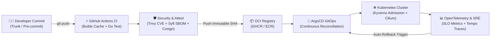

<!-- ========================================================================================= -->
<!--                           ENTERPRISE DEVOPS COMPENDIUM // HERO                            -->
<!-- ========================================================================================= -->

<div align="center">

  <!-- High-Resolution Cyber-Titanium Animated SVG Banner -->
  <a href="https://github.com/Cell1991/Dev-Ops">
    
  </a>

  <br/><br/>

  <!-- Responsive Terminal Typing Stream -->
  <a href="https://github.com/Cell1991/Dev-Ops">
    
  </a>

  <br/>

  <!-- SYSTEM STATUS BADGES -->
  <p align="center">
    
    
    
    
    
    
    
  </p>

  <br/>

  <strong>The Definitive Enterprise DevOps &amp; Platform Engineering Compendium: A battle-tested, production-grade knowledge vault spanning Linux kernel primitives, rootless OCI containers, Infrastructure as Code, declarative GitOps, Kubernetes internals, eBPF networking, distributed OpenTelemetry, zero-trust DevSecOps, SRE error budgets, chaos engineering, and cloud FinOps governance.</strong>

  <br/><br/>

  <!-- TACTICAL NAVIGATION RADAR & SITEMAP MATRIX -->
  <p align="center">
    <a href="#01-devops-continuous-lifecycle">
      
    </a>
    <a href="#02-bento-matrix--architectural-pillars">
      
    </a>
    <a href="#03-taxonomic-tech-radar--landscape">
      
    </a>
    <a href="#04-end-to-end-gitops--security-pipeline">
      
    </a>
  </p>

  <p align="center">
    <a href="#05-comprehensive-curriculum-catalogue">
      
    </a>
    <a href="#06-repository-architecture--code-tree">
      
    </a>
    <a href="#07-production-quick-start--manifests">
      
    </a>
  </p>

</div>

---

<!-- ========================================================================================= -->
<!--                    01. DEVOPS CONTINUOUS LIFECYCLE                                        -->
<!-- ========================================================================================= -->

<div align="center">
  
  <br/><br/>
  
</div>

<br/>

| Stage | Core Mission | Modern Cloud-Native Tooling | Key Engineering Deliverables |
| :--- | :--- | :--- | :--- |
| **01. Plan** | Product requirements, ADRs, agile sprints | Jira, Linear, GitHub Projects | Architectural Decision Records (ADR), issue estimation |
| **02. Code** | Trunk-based development, semantic commits | Git, VS Code, DevContainers | Branch protection rules, pre-commit gitleaks hooks |
| **03. Build** | Deterministic, multi-stage OCI compilation | Docker Buildx, BuildKit, Kaniko | Non-root distroless images, layer cache mounts |
| **04. Test** | Unit, integration, mutation & SAST tests | PyTest, Go Test, Semgrep, Trivy | SARIF security scan reports, Codecov > 85% |
| **05. Release** | Cryptographic signing & SBOM attestation | Cosign (Sigstore), Syft, Helm OCI | SPDX SBOM, cryptographic provenance signature |
| **06. Deploy** | Declarative GitOps reconciliation & Canary | ArgoCD, Argo Rollouts, Flagger | Instant rollback on 5xx spike, 0-downtime deployment |
| **07. Operate** | Kernel-level networking, ingress & mesh | Kubernetes, Cilium eBPF, Istio | Gateway API routing, mTLS, L7 traffic management |
| **08. Observe** | Distributed tracing, metrics & error budgets | OpenTelemetry, Prometheus, Tempo, Loki | Multi-burn-rate SLO alerts, unified trace dashboards |

<br/>

---

<!-- ========================================================================================= -->
<!--                    02. BENTO MATRIX & ARCHITECTURAL PILLARS                               -->
<!-- ========================================================================================= -->

<div align="center">
  
  <br/><br/>
  
</div>

<br/>

| Architectural Pillar | Core Theoretical Rationale | Industrial Impact &amp; Guarantees |
| :--- | :--- | :--- |
| **Platform Engineering &amp; IDP** | Treats developer infrastructure as an internal SaaS product with standardized Golden Paths. | Cuts time-to-production from weeks to $<15$ minutes while guaranteeing organizational compliance. |
| **Declarative GitOps Engine** | Enforces Git as the immutable single source of truth with automated reconciliation loops. | Eliminates manual SSH mutations, eliminates configuration drift, and ensures instant disaster recovery. |
| **eBPF-Powered Networking** | Bypasses legacy Linux `iptables` packet evaluation with kernel-level JIT bytecode programs. | Achieves $<0.2\text{ms}$ network overhead, line-speed L7 load balancing, and deep kernel security tracing. |
| **Supply Chain Security (SLSA L3)** | Attests provenance, signs container layers keylessly, and blocks unverified images at admission. | Prevents solarwinds-style supply chain injections and verifies container integrity before cluster execution. |
| **OpenTelemetry &amp; Error Budgets** | Adopts vendor-neutral telemetry data pipelines and aligns release velocity with reliability goals. | Reduces MTTD to $<90$ seconds and prevents catastrophic outages via multi-window error budget burn alerts. |
| **Cloud FinOps &amp; Rightsizing** | Shifts cloud cost visibility left into developer Pull Requests and utilizes intelligent JIT node scaling. | Cuts organizational cloud waste by $35\%\text{--}45\%$ through Karpenter bin-packing and Infracost gates. |

<br/>

---

<!-- ========================================================================================= -->
<!--                    03. TAXONOMIC TECH RADAR & LANDSCAPE                                   -->
<!-- ========================================================================================= -->

<div align="center">
  
  <br/><br/>
  
</div>

<br/>

### Industry Adoption Radar Classification:

* **Adopt (Proven Standards)**: `Kubernetes`, `Docker Buildx`, `Terraform / OpenTofu`, `GitHub Actions`, `ArgoCD`, `Prometheus / Grafana`, `Cilium eBPF`, `Cosign`, `Trivy`, `Helm 3`.
* **Trial (High Velocity & Modern Growth)**: `OpenTelemetry Collector`, `Kubernetes Gateway API`, `Karpenter Node Autoscaler`, `Spotify Backstage`, `Istio Ambient Mesh`, `Kyverno Policy Engine`, `vCluster`.
* **Assess (Emerging Innovations)**: `Crossplane`, `Score.dev`, `eBPF Falco Modern Runtime`, `Infracost PR Gates`, `Chaos Mesh`.
* **Hold (Legacy / Deprecated)**: `Bare Docker Swarm`, `Legacy Kubernetes Ingress (v1beta1)`, `Long-lived GitFlow feature branches`, `Manual SSH configuration drift`, `Hardcoded static cloud API tokens`.

<br/>

---

<!-- ========================================================================================= -->
<!--                    04. END-TO-END GITOPS & SECURITY PIPELINE                              -->
<!-- ========================================================================================= -->

<div align="center">
  
  <br/><br/>
  
</div>

<br/>



<br/>

---

<!-- ========================================================================================= -->
<!--                    05. COMPREHENSIVE CURRICULUM CATALOGUE                                 -->
<!-- ========================================================================================= -->

<div align="center">
  
</div>

<br/>

### Track 00 // Foundations, Linux Internals & Git
> Kernel isolation primitives, system calls, cgroups, process signals, defensive shell scripting, and Trunk-Based Development.

| Module Guide | Core Concepts Covered | Code / Manifests |
| :--- | :--- | :--- |
| [`00. Linux Internals & Shell`](docs/00-foundations/linux-internals-and-shell.md) | Namespaces (`pid`, `net`, `mnt`), Cgroups v2 (`cpu.max`, `memory.max`), POSIX signals (`SIGTERM`, `SIGKILL`), strict shell scripts | [Bash Entrypoint Standard](docs/00-foundations/linux-internals-and-shell.md#3-high-performance-shell-scripting-standard) |
| [`00. Git & Trunk-Based Dev`](docs/00-foundations/git-trunk-based-development.md) | Trunk-Based Development (TBD), Conventional Commits, Pre-commit security hooks, Git bisect | [Pre-commit YAML](docs/00-foundations/git-trunk-based-development.md#3-pre-commit-hook-security-configuration) |

<br/>

### Track 01 // Containerization & Modern Runtimes
> OCI image architecture, BuildKit caching, non-root execution, distroless runtimes, and Linux capability stripping.

| Module Guide | Core Concepts Covered | Code / Manifests |
| :--- | :--- | :--- |
| [`01. Modern Docker & OCI`](docs/01-containerization/modern-docker-and-oci.md) | Multi-stage builds, BuildKit `--mount=type=cache`, static binary compilation, OCI labels | [`Dockerfile.multistage`](examples/docker/Dockerfile.multistage) |
| [`01. Container Security & Distroless`](docs/01-containerization/container-security-and-distroless.md) | Distroless Debian/Chainguard, dropping `CAP_ALL`, `readOnlyRootFilesystem`, Seccomp profiles | [`compose.production.yml`](examples/docker/compose.production.yml) |

<br/>

### Track 02 // Infrastructure as Code (IaC) & Config Management
> Declarative cloud provisioning with Terraform / OpenTofu, remote S3 backends with DynamoDB locking, and Ansible automation.

| Module Guide | Core Concepts Covered | Code / Manifests |
| :--- | :--- | :--- |
| [`02. Terraform & OpenTofu`](docs/02-infrastructure-as-code/terraform-and-opentofu.md) | State locking, module design, Terragrunt DRY architecture, automated drift detection | [`main.tf`](examples/terraform/main.tf), [`variables.tf`](examples/terraform/variables.tf) |
| [`02. Ansible Configuration`](docs/02-infrastructure-as-code/ansible-and-configuration-management.md) | Idempotent node hardening, kernel sysctl tuning, containerd setup, Ansible Vault | [Node Hardening Playbook](docs/02-infrastructure-as-code/ansible-and-configuration-management.md#1-idempotency--role-based-architecture) |

<br/>

### Track 03 // Enterprise CI/CD & Progressive Delivery
> Keyless OIDC cloud authentication, Docker Buildx caching, ArgoCD GitOps reconciliation, and automated canary analysis.

| Module Guide | Core Concepts Covered | Code / Manifests |
| :--- | :--- | :--- |
| [`03. GitHub Actions CI`](docs/03-cicd-and-gitops/github-actions-enterprise-pipelines.md) | OIDC Workload Identity, GitHub Actions cache, Trivy SARIF reporting, Matrix builds | [`production-pipeline.yml`](examples/cicd/.github/workflows/production-pipeline.yml) |
| [`03. ArgoCD & Canary`](docs/03-cicd-and-gitops/argocd-and-progressive-delivery.md) | Continuous reconciliation loop, self-healing, Argo Rollouts canary traffic shifting | [`application.yaml`](examples/cicd/argocd/application.yaml) |

<br/>

### Track 04 // Kubernetes Orchestration & Cloud Native Ecosystem
> Control plane architecture (etcd Raft, API Server, Scheduler), Pod lifecycle probes, PDBs, Helm, and K8s Gateway API.

| Module Guide | Core Concepts Covered | Code / Manifests |
| :--- | :--- | :--- |
| [`04. K8s Architecture & Pods`](docs/04-kubernetes-ecosystem/k8s-architecture-and-pod-lifecycle.md) | etcd consensus, Kubelet CRI/CNI interaction, `startup/liveness/readiness` probes, PDB | [`base-deployment.yaml`](examples/kubernetes/base-deployment.yaml) |
| [`04. Helm & Gateway API`](docs/04-kubernetes-ecosystem/helm-kustomize-gateway-api.md) | Helm 3 OCI packaging, Kustomize overlays, GatewayClass, Gateway, and HTTPRoute | [`gateway-api-route.yaml`](examples/kubernetes/gateway-api-route.yaml) |

<br/>

### Track 05 // Platform Engineering & Internal Developer Platforms (IDP)
> Golden paths, Spotify Backstage software catalog, Score specification, and ephemeral PR preview environments with vCluster.

| Module Guide | Core Concepts Covered | Code / Manifests |
| :--- | :--- | :--- |
| [`05. Platform Engineering & IDP`](docs/05-platform-engineering/internal-developer-platforms-idp.md) | Platform as a product, Backstage `catalog-info.yaml`, developer self-service portals | [Backstage Catalog Entity](docs/05-platform-engineering/internal-developer-platforms-idp.md#2-spotify-backstage-catalog-entity-catalog-infoyaml) |
| [`05. Ephemeral Envs & vCluster`](docs/05-platform-engineering/multi-tenancy-and-ephemeral-environments.md) | Virtual clusters (vCluster), PR environment lifecycle automation, ResourceQuotas | [vCluster Architecture](docs/05-platform-engineering/multi-tenancy-and-ephemeral-environments.md#1-virtual-clusters-vcluster-architecture) |

<br/>

### Track 06 // Service Mesh, eBPF & Cloud Networking
> High-performance eBPF data planes, Cilium CNI, Istio Ambient mesh (ztunnel & waypoint), and zero-trust L7 network policies.

| Module Guide | Core Concepts Covered | Code / Manifests |
| :--- | :--- | :--- |
| [`06. Istio & Zero-Trust Mesh`](docs/06-networking-and-service-mesh/istio-envoy-and-zero-trust.md) | Ambient sidecarless mesh, HBONE protocol, mutual TLS, Istio `AuthorizationPolicy` | [Istio AuthPolicy](docs/06-networking-and-service-mesh/istio-envoy-and-zero-trust.md#2-zero-trust-authorizationpolicy-example) |
| [`06. Cilium eBPF Networking`](docs/06-networking-and-service-mesh/cilium-and-ebpf-networking.md) | eBPF kernel hooks, bypass iptables, CiliumNetworkPolicy L7 filtering, Hubble observability | [`network-policy.yaml`](examples/kubernetes/network-policy.yaml) |

<br/>

### Track 07 // Observability, OpenTelemetry & SRE Metrics
> OpenTelemetry Collector architecture, W3C tracecontext, Prometheus TSDB, Grafana dashboards, and multi-burn-rate SLO alerts.

| Module Guide | Core Concepts Covered | Code / Manifests |
| :--- | :--- | :--- |
| [`07. OpenTelemetry & Tracing`](docs/07-observability-and-telemetry/opentelemetry-collector-and-tracing.md) | OTel Collector pipeline (Receivers, Processors, Exporters), Grafana Tempo | [`otel-collector-config.yaml`](examples/observability/otel-collector-config.yaml) |
| [`07. Prometheus & SLO/SLI`](docs/07-observability-and-telemetry/prometheus-grafana-and-slo-sli.md) | 4 Golden Signals, mathematical SLI/SLO modeling, multi-window multi-burn-rate alerting | [`prometheus-rules.yaml`](examples/observability/prometheus-rules.yaml) |

<br/>

### Track 08 // DevSecOps, Policy as Code & Supply Chain
> Kubernetes admission control, Kyverno validation, Syft SBOM generation, and Cosign keyless container signing via Sigstore.

| Module Guide | Core Concepts Covered | Code / Manifests |
| :--- | :--- | :--- |
| [`08. Policy as Code: Kyverno`](docs/08-devsecops-and-supply-chain/policy-as-code-kyverno-opa.md) | Validating/Mutating Webhooks, Kyverno ClusterPolicy, blocking root/privileged Pods | [`kyverno-clusterpolicy.yaml`](examples/security/kyverno-clusterpolicy.yaml) |
| [`08. Supply Chain & Cosign`](docs/08-devsecops-and-supply-chain/sbom-cosign-and-secret-management.md) | SLSA L3 standard, Syft SPDX generation, Cosign keyless signatures, HashiCorp Vault | [`trivy-config.yaml`](examples/security/trivy-config.yaml) |

<br/>

### Track 09 // SRE Principles, Error Budgets & Post-Mortems
> Mathematical error budgets ($1 - \text{SLO}$), deployment freeze gates, blameless post-mortem RCA, and interactive runbooks.

| Module Guide | Core Concepts Covered | Code / Manifests |
| :--- | :--- | :--- |
| [`09. Error Budgets & Metrics`](docs/09-sre-and-incident-management/error-budgets-and-reliability-metrics.md) | MTBF, MTTD, MTTR calculations, rolling 30-day budget burn tracking, freeze policies | [Error Budget Formula](docs/09-sre-and-incident-management/error-budgets-and-reliability-metrics.md#1-the-error-budget-calculation-formula) |
| [`09. Blameless Post-Mortems`](docs/09-sre-and-incident-management/postmortem-and-runbook-engineering.md) | 5 Whys root cause analysis, incident timeline reconstruction, actionable P0/P1 tasks | [SEV-1 Postmortem Template](docs/09-sre-and-incident-management/postmortem-and-runbook-engineering.md#1-blameless-incident-post-mortem-template) |

<br/>

### Track 10 // Chaos Engineering & Resiliency
> Principles of chaos experimentation, steady-state hypothesis formulation, Chaos Mesh CRDs, and network partition simulations.

| Module Guide | Core Concepts Covered | Code / Manifests |
| :--- | :--- | :--- |
| [`10. Chaos Mesh Testing`](docs/10-chaos-engineering/chaos-mesh-and-resilience-testing.md) | Steady-state verification, Pod failure injection, cross-AZ latency, automated rollback | [NetworkChaos YAML](docs/10-chaos-engineering/chaos-mesh-and-resilience-testing.md#2-chaos-mesh-experiment-network-latency--packet-loss) |

<br/>

### Track 11 // Cloud FinOps & Cost Governance
> FinOps Framework (Inform, Optimize, Operate), Infracost PR cost estimations, Kubecost allocation, and Karpenter JIT scaling.

| Module Guide | Core Concepts Covered | Code / Manifests |
| :--- | :--- | :--- |
| [`11. FinOps & Cost Governance`](docs/11-finops-and-cost-optimization/cloud-cost-governance-and-kubecost.md) | Shift-left cost gates, Kubernetes container rightsizing, Graviton ARM64 spot instances | [Infracost Action](docs/11-finops-and-cost-optimization/cloud-cost-governance-and-kubecost.md#2-shift-left-cost-estimation-with-infracost-in-github-actions) |

<br/>

---

<!-- ========================================================================================= -->
<!--                    06. REPOSITORY ARCHITECTURE & CODE TREE                                -->
<!-- ========================================================================================= -->

<div align="center">
  
</div>

<br/>

```text
Dev-Ops/
├── assets/                                     # High-Resolution Animated SVG Visuals
│   ├── hero-banner.svg                         # Cyber-Titanium Animated Hero Banner
│   ├── devops-lifecycle.svg                    # Interactive Continuous Delivery Infinity Loop
│   ├── bento-matrix.svg                        # 6-Pillar Architectural Bento Grid
│   ├── tech-stack-matrix.svg                   # Categorized Technology Radar Landscape
│   ├── gitops-pipeline.svg                     # End-to-End Cryptographic Delivery Flow
│   ├── sec_00.svg ... sec_11.svg               # Track Section Header Dividers
│   └── footer.svg                              # Monorepo Footer Banner
├── docs/                                       # In-Depth Theoretical & Architectural Guides
│   ├── 00-foundations/                         # Linux Internals, Syscalls, cgroups & Git TBD
│   ├── 01-containerization/                    # Multi-stage Docker, Distroless & Capabilities
│   ├── 02-infrastructure-as-code/              # Terraform, OpenTofu State & Ansible Playbooks
│   ├── 03-cicd-and-gitops/                     # OIDC GitHub Actions & ArgoCD Reconcilers
│   ├── 04-kubernetes-ecosystem/                # K8s Internals, Probes & Gateway API HTTPRoutes
│   ├── 05-platform-engineering/                # Spotify Backstage IDPs & vCluster Envs
│   ├── 06-networking-and-service-mesh/         # Istio Ambient Mesh & Cilium eBPF CNI
│   ├── 07-observability-and-telemetry/         # OTel Collector, Prometheus & Multi-Burn SLOs
│   ├── 08-devsecops-and-supply-chain/          # Kyverno Policies, Syft SBOM & Cosign Signatures
│   ├── 09-sre-and-incident-management/         # Error Budget Math & Blameless Post-Mortems
│   ├── 10-chaos-engineering/                  # Chaos Mesh Experiments & Steady-State Asserts
│   └── 11-finops-and-cost-optimization/        # Infracost PR Gates & Kubecost Governance
├── examples/                                   # Production-Ready Verified Manifests & Code
│   ├── docker/                                 # Hardened Dockerfile & Compose Manifests
│   ├── kubernetes/                             # Deployment, PDB, NetworkPolicy & Gateway API
│   ├── terraform/                              # AWS VPC & EKS Modular Infrastructure
│   ├── cicd/                                   # GitHub Actions Workflows & ArgoCD Applications
│   ├── security/                               # Kyverno ClusterPolicies & Trivy Configurations
│   └── observability/                          # OpenTelemetry Collector & Prometheus Rules
└── README.md                                   # Master Architecture Compendium
```

<br/>

---

<!-- ========================================================================================= -->
<!--                    07. PRODUCTION QUICK START & CLI WORKFLOWS                             -->
<!-- ========================================================================================= -->

<div align="center">
  
</div>

<br/>

### 1. Build and Run Hardened Distroless Container

```bash
# 1. Build the production multi-stage image with BuildKit cache
DOCKER_BUILDKIT=1 docker build -t ghcr.io/enterprise/microservice:v1.0.0 -f examples/docker/Dockerfile.multistage .

# 2. Run container locally with read-only root and dropped capabilities
docker run --rm -it \
  --read-only \
  --cap-drop=ALL \
  --user 65532:65532 \
  -p 8080:8080 \
  ghcr.io/enterprise/microservice:v1.0.0
```

### 2. Deploy Enterprise Kubernetes Workloads

```bash
# Apply hardened base deployment and PodDisruptionBudget
kubectl apply -f examples/kubernetes/base-deployment.yaml

# Apply Layer-7 Ingress Gateway Route
kubectl apply -f examples/kubernetes/gateway-api-route.yaml

# Apply zero-trust network policy isolation
kubectl apply -f examples/kubernetes/network-policy.yaml
```

### 3. Verify Policy-as-Code & Scan Vulnerabilities

```bash
# Test Kyverno admission policy against manifests
kyverno apply examples/security/kyverno-clusterpolicy.yaml --resource examples/kubernetes/base-deployment.yaml

# Scan local container for critical CVEs and secrets
trivy image --config examples/security/trivy-config.yaml ghcr.io/enterprise/microservice:v1.0.0
```

<br/>

---

<!-- ========================================================================================= -->
<!--                                        FOOTER                                             -->
<!-- ========================================================================================= -->

<div align="center">
  <a href="https://github.com/Cell1991/Dev-Ops">
    
  </a>
</div>
