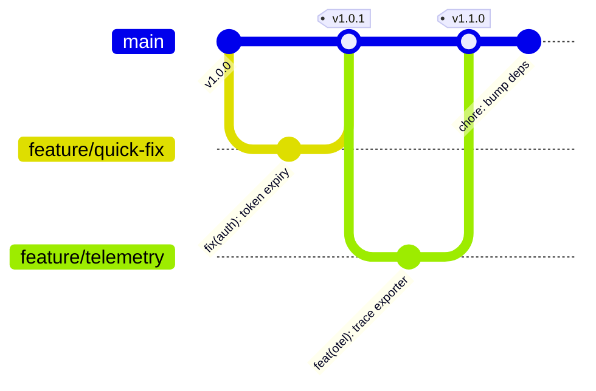

# Track 00 // Git Architecture & Trunk-Based Development (TBD)

High-velocity engineering teams avoid long-lived feature branches. Trunk-Based Development (TBD) coupled with automated CI validation and Feature Flags is the industry gold standard for continuous delivery.

---

## 1. Branching Strategy Comparison



| Criterion | Trunk-Based Development (Recommended) | GitFlow (Legacy) |
| :--- | :--- | :--- |
| **Branch Lifetime** | **< 24 hours** (Short-lived topic branches) | Weeks to months (Long-lived feature/release branches) |
| **Merge Frequency** | Multiple times per day per developer | Bi-weekly or monthly |
| **Merge Conflicts** | Minimal, resolved immediately | Massive "Merge Hell" sessions |
| **Release Mechanism** | Direct from trunk or lightweight release tags | Dedicated `release` & `hotfix` branches |
| **Feature Isolation** | **Feature Flags (LaunchDarkly, Unleash)** | Isolated branches |

---

## 2. Conventional Commits Specification

All commit messages should follow structured semantic formatting to enable automated changelog generation and semantic release bumping:

```text
<type>(<optional scope>): <description>

[optional body]

[optional footer(s)]
```

### Supported Types:
* `feat`: A new user-facing feature (triggers MINOR version bump).
* `fix`: A bug fix (triggers PATCH version bump).
* `perf`: Code change that improves performance.
* `refactor`: Code change that neither fixes a bug nor adds a feature.
* `docs`: Documentation changes only.
* `test`: Adding or correcting tests.
* `chore`: Build system, CI workflow, or dependency updates.
* `BREAKING CHANGE`: In body or footer with `!` (triggers MAJOR version bump).

---

## 3. Pre-Commit Hook Security Configuration

Prevent secret leaks, linting errors, and formatting discrepancies before code ever leaves the developer's laptop.

### Configuration (`.pre-commit-config.yaml`):

```yaml
repos:
  - repo: https://github.com/pre-commit/pre-commit-hooks
    rev: v4.6.0
    hooks:
      - id: trailing-whitespace
      - id: end-of-file-fixer
      - id: check-yaml
        args: ['--allow-multiple-documents']
      - id: check-json
      - id: check-added-large-files
        args: ['--maxkb=500']

  - repo: https://github.com/gitleaks/gitleaks
    rev: v8.18.4
    hooks:
      - id: gitleaks

  - repo: https://github.com/adrienverge/yamllint
    rev: v1.35.1
    hooks:
      - id: yamllint
        args: ['-d', '{extends: relaxed, rules: {line-length: {max: 120}}}']

  - repo: https://github.com/antonbabenko/pre-commit-terraform
    rev: v1.92.0
    hooks:
      - id: terraform_fmt
      - id: terraform_validate
      - id: terraform_tflint
```

---

## 4. Git Advanced Power Commands

```bash
# 1. Interactive rebase to squash and clean last 4 commits
git rebase -i HEAD~4

# 2. Find bug regression using binary search automation
git bisect start
git bisect bad HEAD
git bisect good v1.2.0
git bisect run pytest tests/test_payment.py

# 3. Cherry-pick a specific security commit
git cherry-pick -x <commit-sha>

# 4. Safely push rebased branch without overwriting others' work
git push --force-with-lease origin feature/payment-gateway
```
