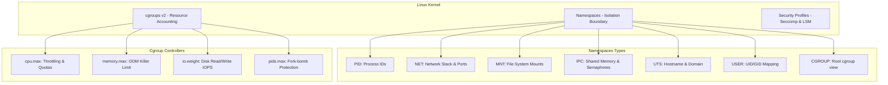
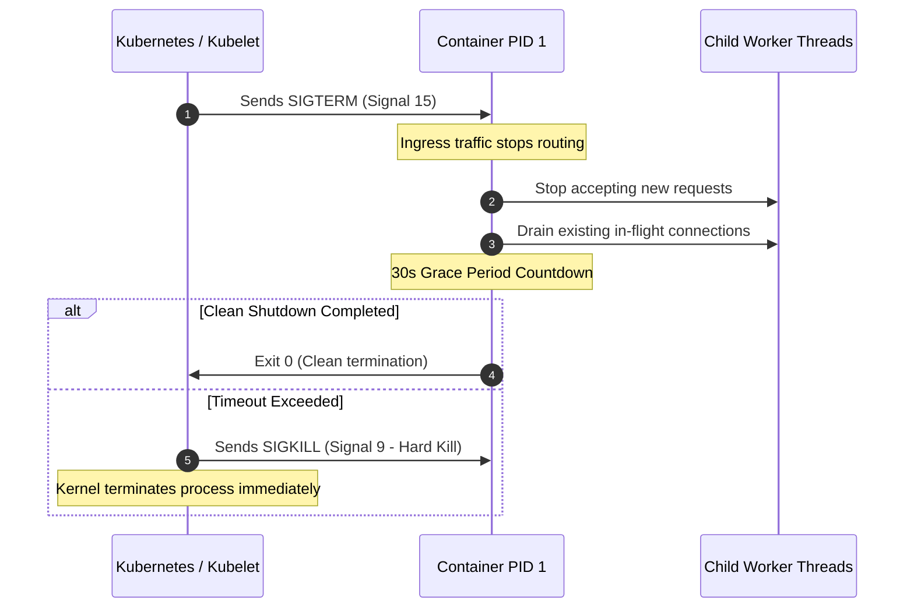

# Track 00 // Linux Internals, Kernel Primitives & Shell Engineering

Linux is the foundational bedrock of all modern cloud-native systems, container runtimes, and distributed infrastructure. Mastering kernel primitives allows engineers to debug low-level container escapes, network latency, resource throttling, and system crashes.

---

## 1. Linux Kernel Primitives for Containers

Modern containers (Docker, containerd, CRI-O) are not hardware virtual machines; they are isolated Linux processes governed by two core kernel primitives: **Namespaces** and **Control Groups (cgroups)**.



### 1.1 Namespaces (Isolation)
Namespaces wrap global system resources in an abstraction that makes it appear to processes within the namespace that they possess their own isolated instance of the resource:
* **`pid`**: Process isolation (`pid 1` inside container is distinct from host PID).
* **`net`**: Isolated network interfaces, IP routing tables, port bindings, and firewall rules.
* **`mnt`**: Independent filesystem mount points (`pivot_root`).
* **`ipc`**: Inter-process communication isolation (System V IPC, POSIX message queues).
* **`uts`**: Hostname and NIS domain name isolation.
* **`user`**: Mapping container root (`UID 0`) to an unprivileged host UID (e.g., `UID 100001`).
* **`cgroup`**: Isolates the `/sys/fs/cgroup` directory view.

### 1.2 Control Groups (cgroups v2)
While namespaces control *what a process can see*, cgroups control *how many resources a process can consume*.

Cgroups v2 provides a unified hierarchy under `/sys/fs/cgroup`:
* `memory.max`: Hard upper limit for RAM. Exceeding this triggers the kernel **OOM (Out Of Memory) Killer**.
* `memory.high`: Throttling boundary before reaching hard limit.
* `cpu.max`: Quota and period (e.g., `100000 100000` = 1 full CPU core).
* `pids.max`: Limits total child processes to prevent malicious fork bombs.

---

## 2. Process Lifecycle & System Signals



### Key Signals in DevOps:
* **`SIGTERM (15)`**: Graceful termination request. Application should close database pools and flush telemetry buffers.
* **`SIGKILL (9)`**: Immediate non-catchable kill by the kernel.
* **`SIGHUP (1)`**: Hangup signal; conventionally used to trigger hot-reloading of configuration files without restarting (e.g., Nginx, Prometheus).
* **`SIGQUIT (3)`**: Termination request that generates a core dump for forensic debugging.

---

## 3. High-Performance Shell Scripting Standard

Every production DevOps automation script must adhere to strict defensive programming patterns.

### Production Shell Script Template (`entrypoint.sh`):

```bash
#!/usr/bin/env bash
# ==============================================================================
# SCRIPT: entrypoint.sh
# DESCRIPTION: Production-grade container bootstrap with strict safety flags
# ==============================================================================

# Strict mode:
# -e: Exit immediately if a command exits with a non-zero status.
# -u: Treat unset variables as an error and exit immediately.
# -o pipefail: Pipeline return status is the value of the last non-zero command.
set -euo pipefail
IFS=$'\n\t'

readonly SCRIPT_NAME="$(basename "${0}")"
readonly LOG_FILE="/var/log/app_init.log"

# Standardized logging function
log_info() {
    echo "[$(date -u +'%Y-%m-%dT%H:%M:%SZ')] [INFO] [${SCRIPT_NAME}]: $*" | tee -a "${LOG_FILE}" >&2
}

log_error() {
    echo "[$(date -u +'%Y-%m-%dT%H:%M:%SZ')] [ERROR] [${SCRIPT_NAME}]: $*" | tee -a "${LOG_FILE}" >&2
}

# Trap unexpected errors and clean up
cleanup() {
    local exit_code=$?
    if [[ ${exit_code} -ne 0 ]]; then
        log_error "Script failed unexpectedly with exit code ${exit_code} at line ${1}"
    fi
    exit "${exit_code}"
}
trap 'cleanup ${LINENO}' EXIT ERR

# Graceful signal handler
handle_sigterm() {
    log_info "Received SIGTERM. Initiating graceful shutdown sequence..."
    if [[ -n "${APP_PID:-}" ]] && kill -0 "${APP_PID}" 2>/dev/null; then
        kill -TERM "${APP_PID}"
        wait "${APP_PID}"
    fi
    log_info "Graceful shutdown complete."
    exit 0
}
trap 'handle_sigterm' SIGTERM SIGINT

# Main Execution Flow
log_info "Verifying required environment variables..."
: "${DATABASE_URL:?DATABASE_URL must be defined and non-empty}"
: "${PORT:=8080}"

log_info "Starting application on port ${PORT}..."
/usr/local/bin/app --port="${PORT}" &
APP_PID=$!

wait "${APP_PID}"
```

---

## 4. Core Network & System Diagnostics Toolkit

| Command | Purpose | Production Use Case |
| :--- | :--- | :--- |
| `ss -tlpn` | Socket statistics | Inspect open listening TCP ports and associated PIDs |
| `ip route show` | Routing table inspection | Troubleshoot gateway mismatches and CNI interfaces |
| `tcpdump -i any -nn port 80` | Raw packet capture | Capture microservice HTTP/gRPC traffic anomalies |
| `nslookup / dig @127.0.0.1` | DNS resolution check | Diagnose CoreDNS lookup timeouts in Kubernetes |
| `strace -p <PID> -f -e trace=network,file` | Syscall interception | Trace blocked I/O, deadlocks, or missing file paths |
| `lsof -i :8080` | List open files/sockets | Find which process is locking a network port |
| `curl -Iv --connect-timeout 2` | HTTP header probe | Inspect TLS handshake errors and latency headers |
