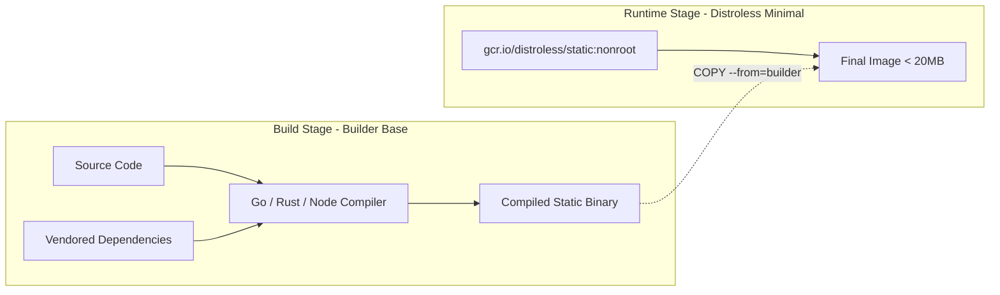

# Track 01 // Modern Containerization & OCI Runtimes

Modern container images must be compact, immutable, reproducible, and strictly unprivileged. BuildKit enables parallel build graphs, cache mounts, and secret injections.

---

## 1. Multi-Stage Dockerfile Architecture



### Production Multi-Stage Dockerfile Example:

```dockerfile
# syntax=docker/dockerfile:1.7
# ==============================================================================
# STAGE 1: Dependency & Compilation Builder
# ==============================================================================
FROM golang:1.23-alpine AS builder

# Install build-time OS dependencies
RUN apk add --no-cache git ca-certificates tzdata

WORKDIR /build

# Leverage BuildKit cache mount for Go module dependencies
COPY go.mod go.sum ./
RUN --mount=type=cache,target=/go/pkg/mod \
    go mod download -x

# Copy application source code
COPY . .

# Build statically linked binary with stripped debug symbols
ARG TARGETOS TARGETARCH
RUN --mount=type=cache,target=/go/pkg/mod \
    --mount=type=cache,target=/root/.cache/go-build \
    CGO_ENABLED=0 GOOS=${TARGETOS} GOARCH=${TARGETARCH} \
    go build -ldflags="-w -s -X main.Version=$(git describe --tags --always)" \
    -o /build/bin/server ./cmd/server

# ==============================================================================
# STAGE 2: Ultra-Minimal Unprivileged Runtime Image
# ==============================================================================
FROM gcr.io/distroless/static-debian12:nonroot

LABEL maintainer="Platform Engineering Team <infra@enterprise.internal>"
LABEL org.opencontainers.image.source="https://github.com/enterprise/service-api"

WORKDIR /app

# Import trusted CA certificates and timezone data from builder
COPY --from=builder /etc/ssl/certs/ca-certificates.crt /etc/ssl/certs/
COPY --from=builder /usr/share/zoneinfo /usr/share/zoneinfo

# Copy compiled executable with explicit non-root ownership (UID: 65532)
COPY --from=builder --chown=65532:65532 /build/bin/server /app/server

# Expose service port
EXPOSE 8080

# Execute as non-root user
USER 65532:65532

ENTRYPOINT ["/app/server"]
```

---

## 2. Dockerfile Anti-Patterns vs Best Practices

| Anti-Pattern | Modern Best Practice | Benefit |
| :--- | :--- | :--- |
| Running as `root` (UID 0) | Explicit `USER nonroot` or `USER 10001` | Prevents container-breakout root privileges on host |
| `RUN apt-get update` without cleanup | Combine in single layer & `rm -rf /var/lib/apt/lists/*` | Shrinks layer footprint |
| Copying secrets into image | Use `RUN --mount=type=secret,id=token` | Secret is never committed into image layer metadata |
| Using `:latest` tags | Pin precise SHA256 digest (`image@sha256:...`) | Guarantees deterministic, reproducible deployments |
| Huge full OS images (`ubuntu`, `node`) | Distroless or minimal Alpine | Eliminates 95% of CVEs and reduces pull latency |
