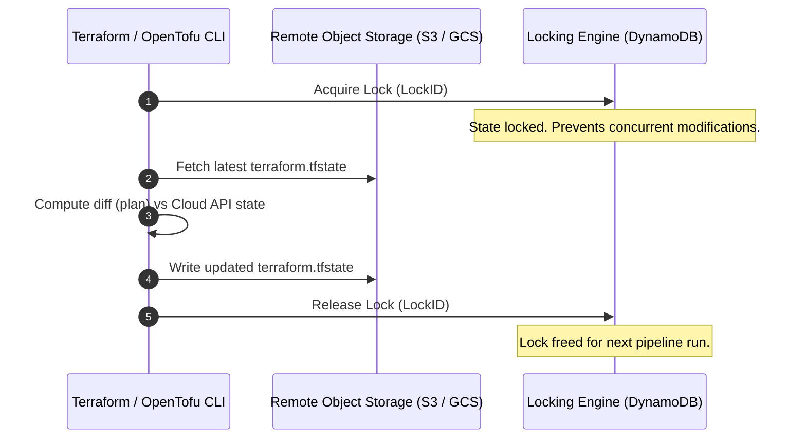

# Track 02 // Infrastructure as Code: Terraform & OpenTofu Architecture

Terraform and OpenTofu provide declarative cloud infrastructure management. Production setups mandate remote state backends, state locking, modular abstractions, and automated drift detection.

---

## 1. Remote State Management & Locking Pattern



---

## 2. Production Terraform Module Example

### `main.tf` - VPC & Cluster Network Module:

```hcl
terraform {
  required_version = ">= 1.8.0"

  required_providers {
    aws = {
      source  = "hashicorp/aws"
      version = "~> 5.50"
    }
  }

  backend "s3" {
    bucket         = "enterprise-tfstate-prod-us-east-1"
    key            = "platform/networking/terraform.tfstate"
    region         = "us-east-1"
    dynamodb_table = "enterprise-tflocks"
    encrypt        = true
  }
}

locals {
  environment = var.environment
  common_tags = {
    Environment = local.environment
    ManagedBy   = "Terraform"
    Project     = "CorePlatform"
  }
}

resource "aws_vpc" "main" {
  cidr_block           = var.vpc_cidr
  enable_dns_hostnames = true
  enable_dns_support   = true

  tags = merge(local.common_tags, {
    Name = "${local.environment}-vpc"
  })
}

resource "aws_subnet" "private" {
  count             = length(var.availability_zones)
  vpc_id            = aws_vpc.main.id
  cidr_block        = cidrsubnet(var.vpc_cidr, 4, count.index)
  availability_zone = var.availability_zones[count.index]

  tags = merge(local.common_tags, {
    Name                              = "${local.environment}-private-${var.availability_zones[count.index]}"
    "kubernetes.io/role/internal-elb" = "1"
  })
}
```

---

## 3. Terragrunt DRY Architecture

Terragrunt keeps Terraform code DRY (Don't Repeat Yourself) across multi-account, multi-region environments:

```text
infrastructure/
 root.hcl               # Global S3 backend & AWS provider definition
 environments/
    dev/
       env.hcl        # environment = "dev"
       vpc/
          terragrunt.hcl
       eks/
           terragrunt.hcl
    prod/
        env.hcl        # environment = "prod"
        vpc/
           terragrunt.hcl
        eks/
            terragrunt.hcl
```
