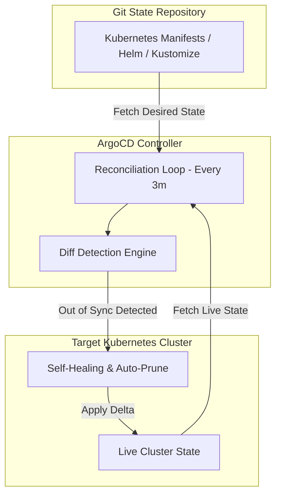

# Track 03 // GitOps & Progressive Delivery with ArgoCD & Rollouts

GitOps treats Git as the single source of truth for declared infrastructure and application state. ArgoCD continuously reconciles differences between Git and the live cluster.

---

## 1. Declarative GitOps Synchronization Cycle



---

## 2. Progressive Canary Release with Argo Rollouts

```yaml
apiVersion: argoproj.io/v1alpha1
kind: Rollout
metadata:
  name: api-service
  namespace: production
spec:
  replicas: 10
  strategy:
    canary:
      analysis:
        templates:
          - templateName: success-rate-check
        args:
          - name: service-name
            value: api-service
      steps:
        - setWeight: 10
        - pause: { duration: 5m }
        - setWeight: 30
        - pause: { duration: 10m }
        - setWeight: 60
        - pause: { duration: 10m }
  template:
    metadata:
      labels:
        app: api-service
    spec:
      containers:
        - name: server
          image: ghcr.io/enterprise/api-service:v2.1.0
          ports:
            - containerPort: 8080
```
