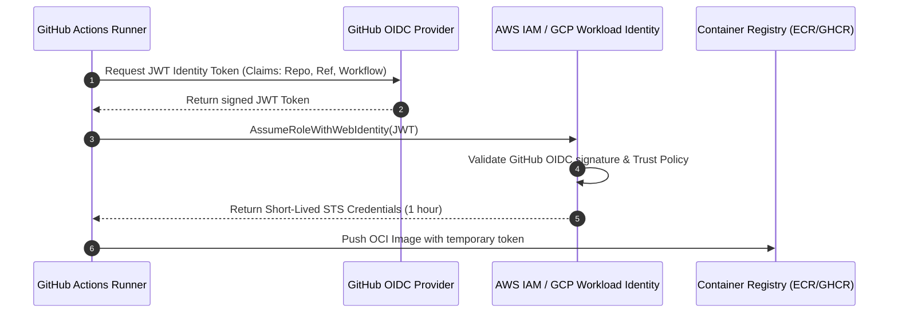

# Track 03 // Enterprise CI/CD with GitHub Actions

Modern CI/CD pipelines prioritize zero-secret authentication (OIDC), fast layer caching, automated vulnerability scanning, and cryptographic artifact signing.

---

## 1. Keyless OIDC Authentication Flow



---

## 2. Production Pipeline Manifest (`.github/workflows/ci.yml`)

```yaml
name: Enterprise Delivery Pipeline

on:
  push:
    branches: [main]
  pull_request:
    branches: [main]

permissions:
  id-token: write
  contents: read
  packages: write
  security-events: write

jobs:
  validate-and-build:
    runs-on: ubuntu-latest
    steps:
      - name: Checkout Source Code
        uses: actions/checkout@v4

      - name: Setup Go Runtime
        uses: actions/setup-go@v5
        with:
          go-version: '1.23'
          cache: true

      - name: Execute Unit & Integration Tests
        run: go test -v -race -coverprofile=coverage.txt ./...

      - name: Set up Docker Buildx
        uses: docker/setup-buildx-action@v3

      - name: Log in to GitHub Container Registry
        uses: docker/login-action@v3
        with:
          registry: ghcr.io
          username: ${{ github.actor }}
          password: ${{ secrets.GITHUB_TOKEN }}

      - name: Build and Push Docker Image with GHA Caching
        uses: docker/build-push-action@v6
        with:
          context: .
          push: ${{ github.event_name == 'push' }}
          tags: ghcr.io/${{ github.repository }}:${{ github.sha }}
          cache-from: type=gha
          cache-to: type=gha,mode=max

      - name: Run Trivy Vulnerability Scanner
        uses: aquasecurity/trivy-action@0.24.0
        with:
          image-ref: ghcr.io/${{ github.repository }}:${{ github.sha }}
          format: 'sarif'
          output: 'trivy-results.sarif'
          severity: 'CRITICAL,HIGH'

      - name: Upload Security SARIF to GitHub Code Scanning
        uses: github/codeql-action/upload-sarif@v3
        if: always()
        with:
          sarif_file: 'trivy-results.sarif'
```
