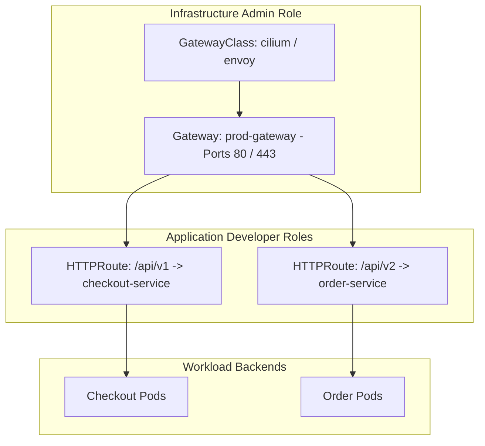

# Track 04 // Helm, Kustomize & Kubernetes Gateway API

Packaging and routing evolution from legacy Ingress to the expressive, role-oriented **Kubernetes Gateway API**.

---

## 1. Kubernetes Gateway API Architecture



### Modern `HTTPRoute` Manifest Example:

```yaml
apiVersion: gateway.networking.k8s.io/v1
kind: HTTPRoute
metadata:
  name: checkout-route
  namespace: production
spec:
  parentRefs:
    - name: prod-gateway
      namespace: infra-gateway
  hostnames:
    - "api.enterprise.com"
  rules:
    - matches:
        - path:
            type: PathPrefix
            value: /api/v1/checkout
      filters:
        - type: RequestHeaderModifier
          requestHeaderModifier:
            add:
              - name: X-Forwarded-Proto
                value: https
      backendRefs:
        - name: checkout-service-v1
          port: 8080
          weight: 90
        - name: checkout-service-v2-canary
          port: 8080
          weight: 10
```
