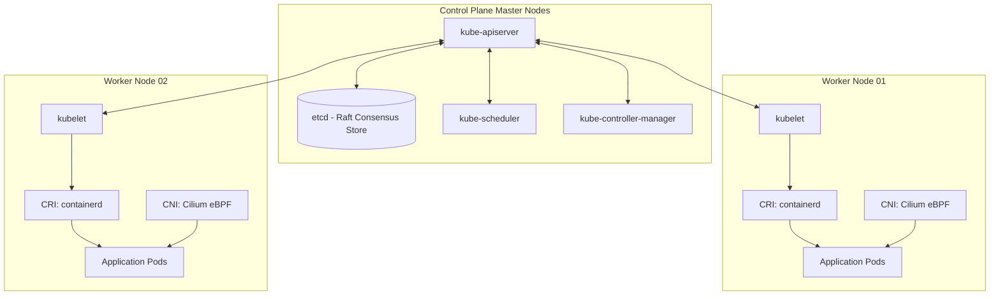

# Track 04 // Kubernetes Internal Architecture & Pod Lifecycle

Kubernetes orchestrates containerized workloads across distributed compute clusters with declarative desired-state management.

---

## 1. Kubernetes Control Plane & Data Plane Architecture



---

## 2. Pod Lifecycle Probes & Graceful Shutdown

1. **`startupProbe`**: Determines if the application within the container has started. All other probes are disabled until this succeeds.
2. **`livenessProbe`**: Determines if the container needs to be restarted. If it fails, kubelet kills and restarts the container.
3. **`readinessProbe`**: Determines if the container is ready to accept incoming traffic. If it fails, the endpoint controller removes the Pod IP from Service load balancing.

```yaml
apiVersion: apps/v1
kind: Deployment
metadata:
  name: resilient-service
spec:
  replicas: 3
  template:
    spec:
      terminationGracePeriodSeconds: 60
      containers:
        - name: app
          image: enterprise/resilient-app:v1.0.0
          lifecycle:
            preStop:
              exec:
                command: ["/bin/sh", "-c", "sleep 15"]
          startupProbe:
            httpGet:
              path: /healthz/startup
              port: 8080
            failureThreshold: 30
            periodSeconds: 2
          livenessProbe:
            httpGet:
              path: /healthz/liveness
              port: 8080
            periodSeconds: 10
            timeoutSeconds: 3
          readinessProbe:
            httpGet:
              path: /healthz/readiness
              port: 8080
            periodSeconds: 5
            timeoutSeconds: 2
```
