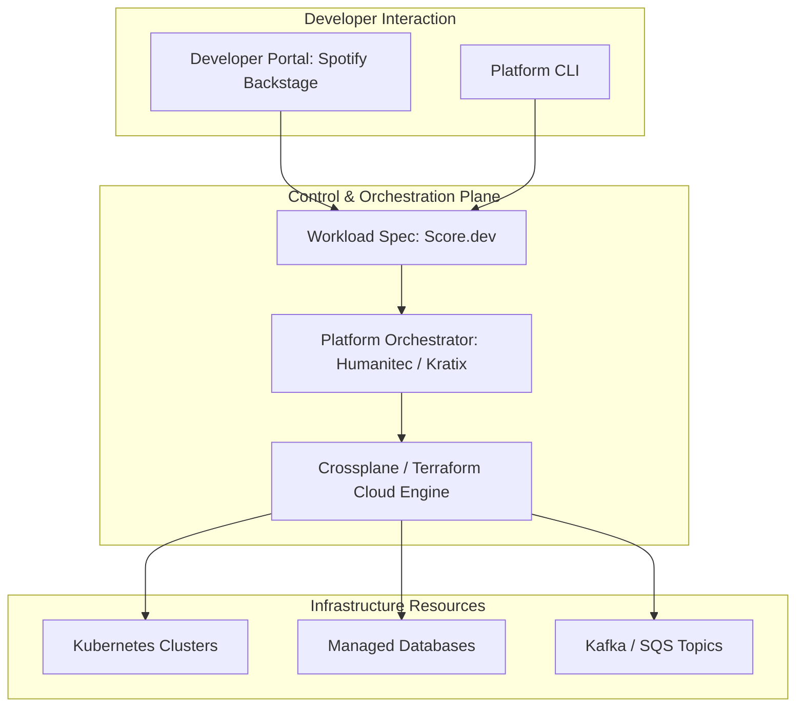

# Track 05 // Platform Engineering & Internal Developer Platforms (IDP)

Platform Engineering treats the developer infrastructure as an internal product. The objective is establishing **Golden Paths** to reduce cognitive load while maintaining security and governance guardrails.

---

## 1. Platform Engineering Stack



---

## 2. Spotify Backstage Catalog Entity (`catalog-info.yaml`)

```yaml
apiVersion: backstage.io/v1alpha1
kind: Component
metadata:
  name: payment-orchestrator
  description: Handles PCI-DSS compliant credit card authorization workflows
  tags:
    - golang
    - payments
    - critical-tier-1
  annotations:
    github.com/project-slug: enterprise/payment-orchestrator
    backstage.io/techdocs-ref: dir:.
    argocd/app-name: prod-payment-orchestrator
    prometheus.io/rule: payment_processing_latency
spec:
  type: service
  lifecycle: production
  owner: payments-squad
  system: core-banking
  providesApis:
    - payment-grpc-api
  dependsOn:
    - resource:aurora-postgres-cluster
    - resource:fraud-detection-topic
```
