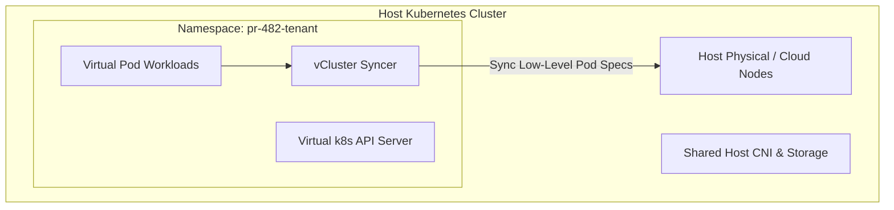

# Track 05 // Multi-Tenancy & Ephemeral Preview Environments

Ephemeral environments provide disposable, isolated, production-like staging environments created dynamically on Pull Request creation and destroyed on PR merge.

---

## 1. Virtual Clusters (vCluster) Architecture

### Benefits:
* Developers have full `cluster-admin` privileges inside their virtual cluster without endangering the physical host cluster.
* Spins up in < 15 seconds compared to minutes for full cloud clusters.
* Significantly cuts staging infrastructure cloud spend.
