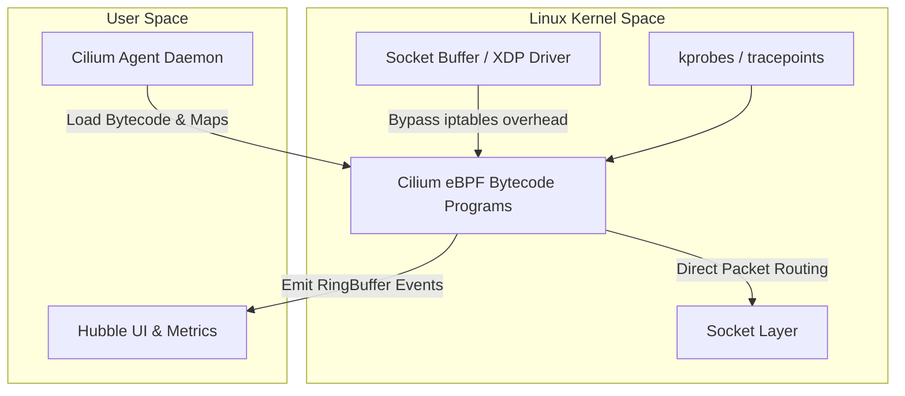

# Track 06 // eBPF & Cilium High-Performance Networking

Extended Berkeley Packet Filter (eBPF) executes sandboxed bytecode inside the Linux kernel without changing kernel source code or loading kernel modules.

---

## 1. eBPF Kernel Hook Architecture



---

## 2. Layer 7 Cilium Network Policy

```yaml
apiVersion: cilium.io/v2
kind: CiliumNetworkPolicy
metadata:
  name: secure-frontend-to-backend
  namespace: default
spec:
  endpointSelector:
    matchLabels:
      app: backend-api
  ingress:
    - fromEndpoints:
        - matchLabels:
            app: frontend-ui
      toPorts:
        - ports:
            - port: "8080"
              protocol: TCP
          rules:
            http:
              - method: "GET"
                path: "/api/v1/products/.*"
              - method: "POST"
                path: "/api/v1/cart"
```
