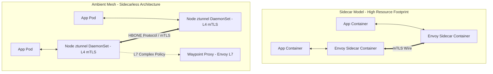

# Track 06 // Service Mesh, Envoy & Zero-Trust Architecture

A Service Mesh provides transparent, infrastructure-level mutual TLS (mTLS), fine-grained Layer 7 traffic routing, fault injection, and distributed telemetry.

---

## 1. Sidecar vs Ambient Mesh Architecture



---

## 2. Zero-Trust `AuthorizationPolicy` Example

```yaml
apiVersion: security.istio.io/v1beta1
kind: AuthorizationPolicy
metadata:
  name: strict-payment-access
  namespace: production
spec:
  selector:
    matchLabels:
      app: payment-service
  action: ALLOW
  rules:
    - from:
        - source:
            principals: ["cluster.local/ns/production/sa/checkout-service-sa"]
      to:
        - operation:
            methods: ["POST"]
            paths: ["/v1/charge"]
```
