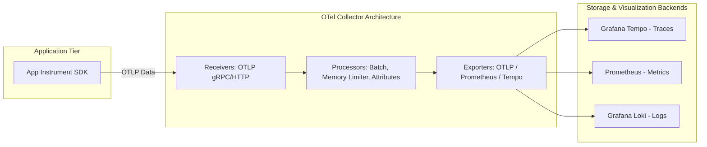

# Track 07 // OpenTelemetry (OTel) Collector & Distributed Tracing

OpenTelemetry is the vendor-agnostic CNCF standard for generating, collecting, processing, and exporting telemetry data (Traces, Metrics, Logs).

---

## 1. OpenTelemetry Collector Pipeline Architecture



---

## 2. Production `otel-collector-config.yaml`

```yaml
receivers:
  otlp:
    protocols:
      grpc:
        endpoint: 0.0.0.0:4317
      http:
        endpoint: 0.0.0.0:4318

processors:
  memory_limiter:
    check_interval: 1s
    limit_percentage: 75
    spike_limit_percentage: 15

  batch:
    send_batch_size: 8192
    timeout: 5s

  resourcedetection:
    detectors: [env, gcp, ecs, ec2, k8snode]
    timeout: 2s

exporters:
  otlp/tempo:
    endpoint: tempo-distributor.monitoring.svc.cluster.local:4317
    tls:
      insecure: true

  prometheus:
    endpoint: 0.0.0.0:8889
    namespace: otel

service:
  pipelines:
    traces:
      receivers: [otlp]
      processors: [memory_limiter, resourcedetection, batch]
      exporters: [otlp/tempo]
    metrics:
      receivers: [otlp]
      processors: [memory_limiter, batch]
      exporters: [prometheus]
```
