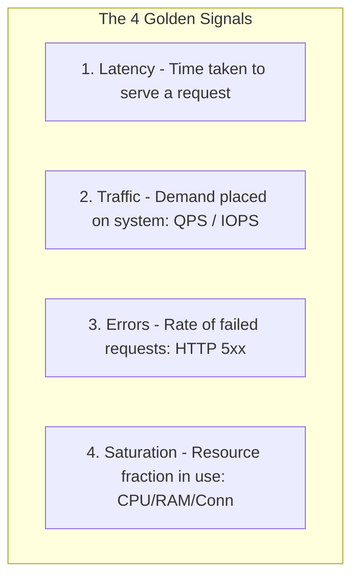

# Track 07 // Prometheus, Alertmanager & SRE SLO/SLI Metrics

Reliability engineering requires mathematical formulation of Service Level Indicators (SLIs) and multi-window multi-burn-rate alerting.

---

## 1. SRE Four Golden Signals



---

## 2. Error Budget Multi-Burn-Rate Prometheus Alerting Rule

An error budget burn rate of $1$ means the entire error budget will be consumed in exactly the measurement period (e.g., 30 days). A burn rate of $14.4$ exhausts 2% of budget in 1 hour.

$$	ext{Burn Rate} = rac{	ext{Observed Error Rate}}{1 - 	ext{SLO Target}}$$

```yaml
groups:
  - name: ServiceLevelObjectives
    rules:
      - alert: HighErrorRateBurnRate14x
        expr: |
          (
            sum(rate(http_requests_total{status=~"5.."}[1h]))
            /
            sum(rate(http_requests_total[1h]))
          ) > (1 - 0.999) * 14.4
          and
          (
            sum(rate(http_requests_total{status=~"5.."}[5m]))
            /
            sum(rate(http_requests_total[5m]))
          ) > (1 - 0.999) * 14.4
        for: 2m
        labels:
          severity: critical
          pager: oncall-engineer
        annotations:
          summary: "API 99.9% SLO Error Budget Burning at 14.4x (2% exhausted in 1h)"
          runbook_url: "https://wiki.enterprise.internal/runbooks/api-error-budget"
```
