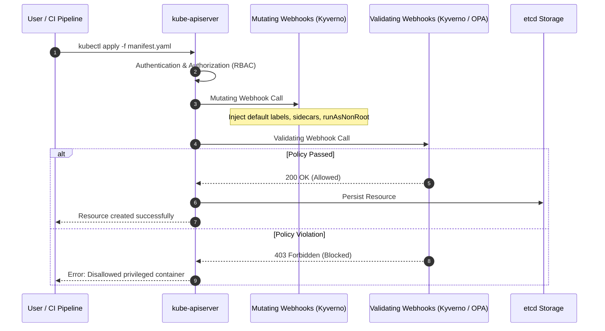

# Track 08 // Policy as Code: Kyverno & OPA Gatekeeper

Admission controllers act as the gatekeeper for Kubernetes API requests, validating or mutating objects before they are committed to `etcd`.

---

## 1. Kubernetes Admission Controller Lifecycle



---

## 2. Kyverno ClusterPolicy: Enforce Restricted Security Standard

```yaml
apiVersion: kyverno.io/v1
kind: ClusterPolicy
metadata:
  name: disallow-privileged-and-root
  annotations:
    policies.kyverno.io/title: Disallow Privileged Containers and Root User
    policies.kyverno.io/severity: high
spec:
  validationFailureAction: Enforce
  background: true
  rules:
    - name: check-privileged
      match:
        any:
          - resources:
              kinds:
                - Pod
      validate:
        message: "Privileged containers and root execution are forbidden in this cluster."
        pattern:
          spec:
            =(securityContext):
              =(runAsNonRoot): true
            containers:
              - =(securityContext):
                  =(privileged): false
                  =(allowPrivilegeEscalation): false
```
