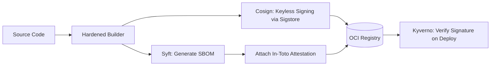

# Track 08 // Supply Chain Security, Cosign & Secret Governance

Secure the software supply chain according to SLSA (Supply-chain Levels for Software Artifacts) standards using Software Bill of Materials (SBOM) and keyless cryptographic signing.

---

## 1. Supply Chain Security Pipeline (SLSA Level 3)



---

## 2. Cosign & Syft Execution Commands

```bash
# 1. Generate SBOM in SPDX JSON format
syft packages ghcr.io/enterprise/app:v1.0.0 -o spdx-json=sbom.spdx.json

# 2. Keyless Sign OCI Image with GitHub OIDC token
cosign sign --yes ghcr.io/enterprise/app:v1.0.0

# 3. Attest SBOM to the image
cosign attest --yes --predicate sbom.spdx.json --type spdx ghcr.io/enterprise/app:v1.0.0

# 4. Verify signature cryptographically before cluster admission
cosign verify \
  --certificate-identity "https://github.com/enterprise/app/.github/workflows/ci.yml@refs/heads/main" \
  --certificate-oidc-issuer "https://token.actions.githubusercontent.com" \
  ghcr.io/enterprise/app:v1.0.0
```
