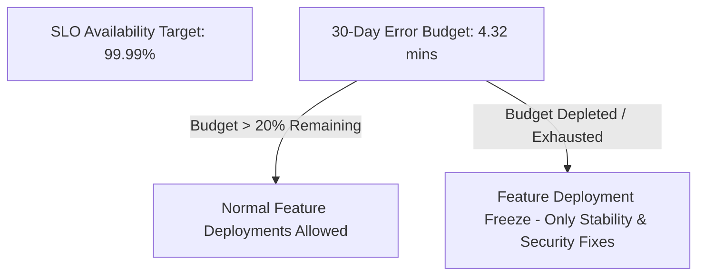

# Track 09 // SRE Principles & Error Budget Management

Site Reliability Engineering treats operations as a software engineering problem. The cornerstone is aligning product feature velocity with availability through **Error Budgets**.

---

## 1. The Error Budget Calculation Formula

$$	ext{Error Budget} = 1 - 	ext{SLO}$$

For a service targeting $99.99\%$ availability over a rolling $30$-day window:

* Allowed Downtime = $30 	imes 24 	imes 60 	imes (1 - 0.9999) = 4.32 	ext{ minutes per month}$

