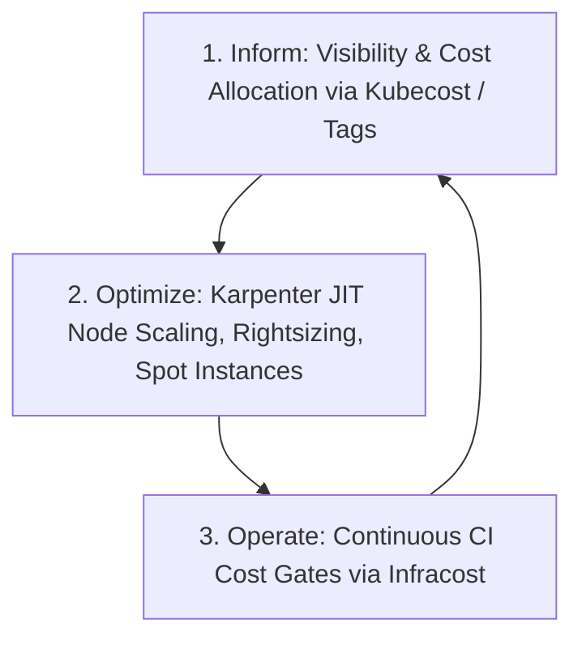

# Track 11 // Cloud FinOps & Kubernetes Cost Governance

Cloud FinOps is an operational framework that combines finance, engineering, and business teams to bring financial accountability to variable cloud spend.

---

## 1. FinOps Framework Phases



---

## 2. Shift-Left Cost Estimation with Infracost in GitHub Actions

```yaml
- name: Setup Infracost
  uses: infracost/actions/setup@v3
  with:
    api-key: ${{ secrets.INFRACOST_API_KEY }}

- name: Generate Infracost Cost Estimate Baseline
  run: infracost breakdown --path=infrastructure/terraform --format=json --out-file=infracost.json

- name: Post Infracost PR Comment
  uses: infracost/actions/comment@v3
  with:
    path: infracost.json
    behavior: update
```
